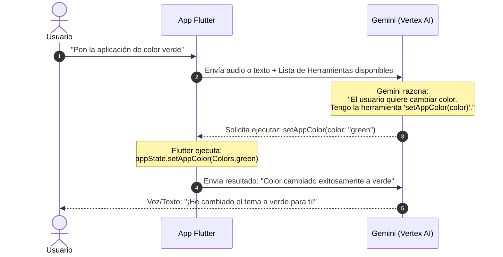
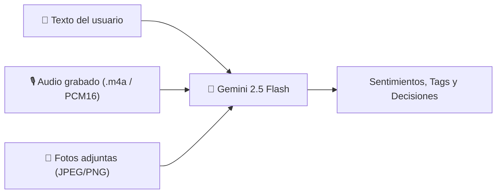
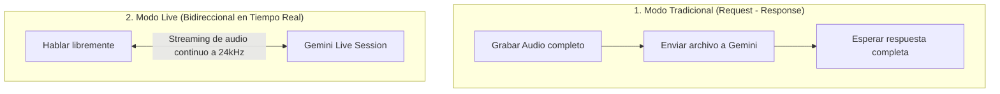

# 🧠 Conceptos Fundamentales

Antes de escribir código, es crucial entender los **3 pilares** que convierten un modelo de lenguaje convencional en un **agente interactivo en Flutter**:

1. **Function Calling (Llamada a Herramientas)**
2. **Multimodalidad Nativa (Texto, Audio e Imágenes)**
3. **Streaming Bidireccional en Tiempo Real (Live API)**

---

## 1. ¿Qué es Function Calling (Llamada a Funciones)?

Tradicionalmente, cuando le pides algo a una IA, ella responde con un texto:
> **Usuario:** *"Por favor cambia el color de mi app a verde"*  
> **IA Normal:** *"¡Listo! He cambiado tu app a verde."* (¡Mentira! No cambió nada porque no tiene acceso a tu teléfono).

Con **Function Calling**, la IA se convierte en un operador de tu aplicación:



### ¿Cómo sabe la IA qué funciones existen?
Tú le proporcionas al modelo una "carta de herramientas" (`Tool.functionDeclarations`). Cada herramienta describe:
- **Nombre:** Ej. `setAppColor`
- **Descripción en lenguaje natural:** *"Cambia el color primario de la aplicación"*
- **Parámetros esperados:** Un string con el nombre del color en inglés.

El modelo **no ejecuta el código por sí mismo** (por seguridad). En su lugar, el modelo te dice: *"Oye Flutter, ejecuta la función `setAppColor` con el argumento `green`"*. Tu aplicación Flutter ejecuta el código local y le devuelve la confirmación.

---

## 2. Multimodalidad: Mucho más que texto

Un agente moderno no solo procesa cadenas de texto. En este proyecto, Gemini interactúa con tres modalidades al mismo tiempo:



En Flutter con el SDK `firebase_ai`, enviar una imagen o un audio es tan simple como usar un `InlineDataPart`:

```dart
// Enviar texto y una foto juntos a Gemini
final response = await geminiModel.generateContent([
  Content.multi([
    TextPart('¿Qué emoción transmite esta imagen y este texto?'),
    InlineDataPart('image/jpeg', imageBytes),
  ]),
]);
```

---

## 3. Streaming Bidireccional vs Petición Tradicional

Existen dos formas en las que una aplicación Flutter puede comunicarse con la IA:



### Modo Tradicional (Voz Clásica)
- **Flujo:** Presionas grabar ➔ hablas ➔ presionas parar ➔ esperas 2 segundos ➔ recibes la respuesta.
- **Ideal para:** Transcripción de audios largos, generación de resúmenes o análisis en segundo plano cuando guardas un formulario.

### Modo Live (Gemini Live API)
- **Flujo:** Abres un canal continuo WebSocket con el modelo `gemini-live-2.5-flash-native-audio`.
- Mientras hablas, tu micrófono envía pequeños trozos de audio (PCM a 24.000 Hz).
- Antes de que termines de respirar, el modelo ya está reproduciendo su respuesta con voz sintética ultra-natural.
- Si interrumpes al modelo ("¡espera!"), el modelo detecta la interrupción (**Barge-in**) y detiene su voz de inmediato.

---

## 4. Conectando la IA con el Estado de Flutter

El secreto de una app agéntica bien diseñada es mantener la IA desacoplada de la interfaz gráfica:

- **La UI:** Escucha cambios en el estado mediante `Provider` o `ChangeNotifier`.
- **El Agente:** Recibe peticiones, consulta a Gemini y, cuando se requiere una acción, modifica el `AppState` o la base de datos `sqflite`.
- **El Resultado:** La interfaz se actualiza automáticamente gracias a la reactividad de Flutter.

En el siguiente capítulo prepararemos el entorno paso a paso.
