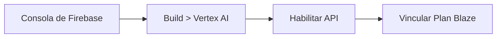

# 🚀 Configuración y Puesta en Marcha

Para comenzar a construir o ejecutar aplicaciones con Vertex AI en Flutter, necesitas preparar tu entorno. Esta guía te muestra exactamente qué instalar y cómo conectar tu proyecto con Firebase.

---

## 🛠️ 1. Requisitos Previos

Asegúrate de tener instaladas las siguientes herramientas:

- **Flutter SDK**: Versión `3.10.1` o superior ([Instalar Flutter](https://docs.flutter.dev/get-started/install)).
- **Node.js**: Para las herramientas de línea de comandos de Firebase.
- **FlutterFire CLI**: La herramienta oficial para vincular proyectos Flutter con Firebase.
  ```bash
  dart pub global activate flutterfire_cli
  ```

---

## ☁️ 2. Habilitar Vertex AI en Firebase

Firebase Vertex AI te permite acceder a los modelos Gemini e Imagen utilizando la infraestructura segura de Google Cloud sin exponer tus claves de API secretas en la app móvil.

1. Ingresa a la [Consola de Firebase](https://console.firebase.google.com/) y crea o selecciona un proyecto.
2. En la barra lateral izquierda, dirígete a **Build (Construcción) > Vertex AI in Firebase**.
3. Haz clic en **Comenzar / Get Started** para habilitar la API.
4. **Importante:** Asegúrate de que tu proyecto tenga activo el plan **Blaze** (pago por uso de Google Cloud). Vertex AI cuenta con una capa gratuita generosa para pruebas y desarrollo.



---

## 📲 3. Vincular Firebase a tu App Flutter

Ubícate en la carpeta `example/` del proyecto y ejecuta el configurador interactivo de FlutterFire:

```bash
cd example
flutterfire configure
```

- Selecciona tu proyecto de Firebase.
- Elige las plataformas que deseas soportar (Android, iOS, Web, macOS).
- Este comando generará automáticamente tu archivo de opciones en `lib/firebase_options.dart`.

:::note Ubicación en este proyecto
En VoiceFlow Diary, el archivo se encuentra en `lib/config/firebase/firebase_options.dart`. Si generaste uno nuevo, actualiza las referencias para que apunten a tu configuración.
:::

---

## 📦 4. Dependencias Clave en `pubspec.yaml`

El archivo `example/pubspec.yaml` utiliza los siguientes paquetes esenciales:

```yaml
dependencies:
  flutter:
    sdk: flutter

  # 🧠 Inteligencia Artificial con Firebase Vertex AI
  firebase_core: ^4.3.0
  firebase_ai: ^3.6.1

  # 🎙️ Entrada y Salida de Audio
  record: ^6.1.2            # Captura de micrófono y streaming de audio PCM16
  flutter_soloud: ^3.4.7     # Motor C++ para reproducción de audio en tiempo real
  audio_session: 0.2.2       # Gestión de foco de audio en iOS y Android

  # 💾 Estado y Base de Datos Local
  provider: ^6.1.5+1         # Manejo de estado reactivo
  sqflite: ^2.4.1           # Base de datos SQLite local
  path_provider: ^2.1.5     # Rutas de almacenamiento local

  # 📸 Medios y Permisos
  image_picker: ^1.0.7       # Selección y toma de fotos
  permission_handler: ^11.3.0 # Gestión de permisos en tiempo de ejecución
```

Descarga las dependencias con:

```bash
flutter pub get
```

---

## 🔒 5. Permisos de Hardware (Micrófono y Cámara)

Debido a que los agentes escuchan y ven, debes declarar los permisos en las plataformas nativas:

### Android (`example/android/app/src/main/AndroidManifest.xml`)
```xml
<manifest ...>
    <!-- Grabación de audio para notas y asistente Live -->
    <uses-permission android:name="android.permission.RECORD_AUDIO" />
    <uses-permission android:name="android.permission.INTERNET" />
    <!-- Cámara y selección de fotos -->
    <uses-permission android:name="android.permission.CAMERA" />
    <uses-permission android:name="android.permission.READ_MEDIA_IMAGES" />
</manifest>
```

### iOS (`example/ios/Runner/Info.plist`)
```xml
<dict>
    <key>NSMicrophoneUsageDescription</key>
    <string>VoiceFlow Diary necesita tu micrófono para transcribir notas y hablar con el asistente de voz en tiempo real.</string>
    <key>NSCameraUsageDescription</key>
    <string>Permite capturar fotos para enriquecer las entradas de tu diario.</string>
    <key>NSPhotoLibraryUsageDescription</key>
    <string>Permite seleccionar fotos existentes de tu galería.</string>
</dict>
```

---

## ▶️ 6. Ejecutar la Aplicación

Conecta tu teléfono o inicia un emulador y corre:

```bash
# Ejecutar en Android
flutter run -d android

# Ejecutar en iOS
flutter run -d ios

# Ejecutar en Google Chrome
flutter run -d chrome

# Ejecutar en macOS
flutter run -d macos
```

¡Tu entorno está listo! En el próximo capítulo exploraremos la arquitectura de la aplicación.
