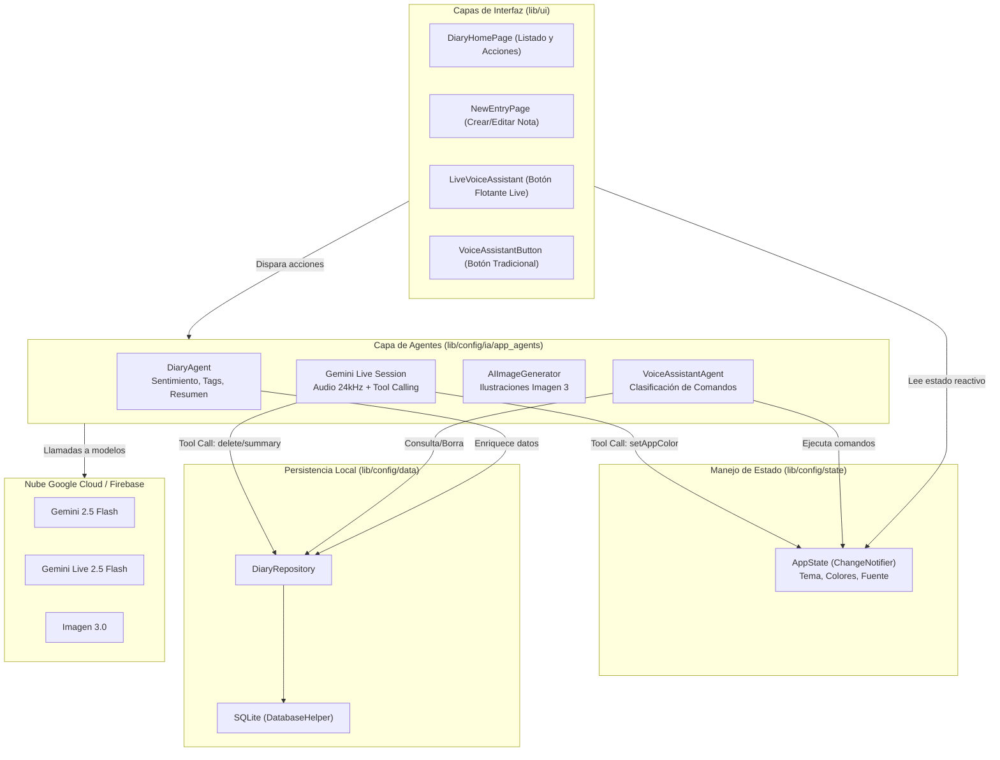

# 🏗️ Arquitectura y Estructura del Proyecto

Una aplicación agéntica requiere una separación clara de responsabilidades: los widgets no deben contener lógica de IA ni prompts hardcodeados. En este capítulo veremos cómo está organizado **VoiceFlow Diary** para ser limpio, modular y fácil de mantener.

---

## 📐 Diagrama de Arquitectura Global

El flujo de información sigue un patrón unidireccional y reactivo:



---

## 📁 Estructura de Directorios

El código dentro de `example/lib` está organizado de la siguiente manera:

```text
example/lib/
├── config/
│   ├── app/
│   │   └── app.dart                 # Configuración del MaterialApp y BetterFeedback
│   ├── data/
│   │   ├── database_helper.dart     # Conexión y tablas SQLite locales
│   │   └── diary_repository.dart   # Métodos CRUD para las entradas del diario
│   ├── firebase/
│   │   └── firebase_options.dart    # Credenciales generadas por FlutterFire
│   ├── ia/
│   │   ├── app_agents/
│   │   │   ├── diary_agent.dart           # 🧠 Agente de análisis de texto/fotos
│   │   │   ├── voice_assistant_agent.dart # 🎤 Agente de comandos tradicionales
│   │   │   └── image_generator.dart       # 🎨 Generador de portadas con Imagen 3
│   │   └── models/
│   │       └── ia_models.dart       # Constantes con los nombres de modelos
│   ├── models/
│   │   └── diary_entry.dart         # Modelo de datos con Sentiment y Tags
│   └── state/
│       └── app_state.dart           # Estado reactivo global (tema y color de la app)
├── ui/
│   ├── pages/
│   │   ├── diary_home_page.dart     # Pantalla principal con feed de entradas
│   │   └── new_entry_page.dart      # Pantalla de creación y análisis automático
│   └── widgets/
│       ├── entry_card.dart          # Tarjeta visual de cada entrada
│       ├── live_voice_assistant.dart# 🔮 Widget y lógica de Gemini Live
│       ├── voice_assistant_button.dart# 🗣️ Botón de comandos de voz clásicos
│       └── voice_command_button.dart  # 🎙️ Botón para dictar entradas directas
└── main.dart                        # Punto de entrada de la aplicación
```

---

## 🎯 Centralización de Modelos (`ia_models.dart`)

En lugar de escribir nombres de modelos repetidos por todo el código, definimos una clase de configuración:

```dart
// example/lib/config/ia/models/ia_models.dart
class IAModels {
  IAModels._();

  /// Modelo para razonamiento rápido, clasificación, análisis de texto e imágenes
  static const String chatModelGemini = 'gemini-2.5-flash';

  /// Modelo para generación de imágenes artísticas de alta calidad
  static const String imageModelGemini = 'imagen-3.0-generate-002';

  /// Modelo para audio bidireccional en tiempo real (Live API).
  /// Requiere audio nativo para responder con baja latencia.
  static const String liveModelGemini = 'gemini-live-2.5-flash-native-audio';
}
```

:::tip ¿Por qué usar modelos diferentes?
No existe un único modelo que sirva para todo.
- **`gemini-2.5-flash`**: Es ultra rápido, económico y multimodal (ideal para clasificar y resumir).
- **`imagen-3.0`**: Especializado en generar imágenes foto-realistas o artísticas a partir de texto.
- **`gemini-live-2.5-flash-native-audio`**: Diseñado específicamente para streaming de voz bidireccional continua con soporte de interrupción (Barge-in).
:::

---

## 🤝 El Patrón Multi-Agente

En lugar de crear un único agente "todoterreno" que haga todo con un prompt gigante e inestable, el proyecto divide la responsabilidad en **agentes especializados**:

| Agente | Responsabilidad Principal | Modelo Usado |
| :--- | :--- | :--- |
| **DiaryAgent** | Analizar emociones, extraer tags y resumir contenido. | `gemini-2.5-flash` |
| **AIImageGenerator** | Crear ilustraciones artísticas basadas en el texto. | `imagen-3.0-generate-002` |
| **VoiceAssistantAgent** | Clasificar intenciones de voz y ejecutar acciones paso a paso. | `gemini-2.5-flash` |
| **LiveVoiceAssistant** | Asistente de voz interactivo en tiempo real con herramientas. | `gemini-live-2.5-flash-native-audio` |

En los siguientes capítulos aprenderemos a construir cada uno de estos agentes paso a paso.
