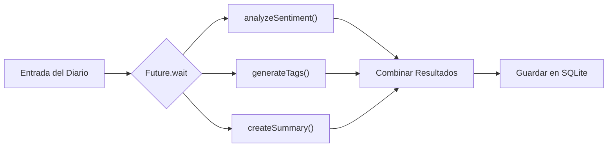

# 📝 Agente 1: Análisis Multimodal (`DiaryAgent`)

El primer agente que construiremos se llama **`DiaryAgent`**. Su misión es actuar como un psicólogo y editor personal: cuando el usuario escribe una nota o adjunta fotos, el agente analiza todo el material para:

1. Detectar el **sentimiento emocional** (desde muy positivo hasta negativo).
2. Generar de 2 a 5 **etiquetas inteligentes (tags)**.
3. Crear un **resumen conciso** si el texto es largo.
4. Transcribir notas de voz grabadas a texto.

---

## 🛠️ 1. Inicialización del Agente

Creamos una clase Singleton que inicializa el modelo `gemini-2.5-flash` mediante el SDK `firebase_ai`:

```dart
import 'package:firebase_ai/firebase_ai.dart';
import 'package:example/config/ia/models/ia_models.dart';

class DiaryAgent {
  static final DiaryAgent _instance = DiaryAgent._internal();
  factory DiaryAgent() => _instance;
  DiaryAgent._internal();

  // Instancia del modelo generativo multimodal
  final _gemini = FirebaseAI.vertexAI().generativeModel(
    model: IAModels.chatModelGemini,
  );
}
```

---

## 🎭 2. Análisis de Sentimiento Multimodal

Un aspecto clave de una app agéntica es que no solo lee el texto, sino que **observa las fotos adjuntas** para entender el contexto completo:

```dart
Future<Sentiment> analyzeSentiment({
  required String content,
  String? title,
  List<String>? imagePaths,
}) async {
  try {
    // 1. Construir el prompt estructurado
    final prompt = _buildSentimentPrompt(content, title);
    final parts = <Part>[TextPart(prompt)];

    // 2. Adjuntar hasta 3 fotos como bytes JPEG
    if (imagePaths != null && imagePaths.isNotEmpty) {
      for (var i = 0; i < imagePaths.length && i < 3; i++) {
        final imageFile = File(imagePaths[i]);
        if (await imageFile.exists()) {
          final bytes = await imageFile.readAsBytes();
          parts.add(InlineDataPart('image/jpeg', bytes));
        }
      }
    }

    // 3. Consultar a Gemini
    final response = await _gemini.generateContent([Content.multi(parts)]);
    final text = response.text?.trim().toLowerCase() ?? '';

    // 4. Mapear la respuesta de la IA a nuestro Enum Dart
    return _parseSentiment(text);
  } catch (e) {
    debugPrint('Error en analyzeSentiment: $e');
    return Sentiment.neutral;
  }
}
```

### El Prompt Estructurado
Para que la IA no responda con explicaciones largas, le exigimos devolver **únicamente una palabra clave**:

```dart
String _buildSentimentPrompt(String content, String? title) {
  return '''
Analiza el sentimiento emocional de esta entrada de diario.
${title != null && title.isNotEmpty ? 'Título: $title\n' : ''}
Contenido: $content

Responde SOLO con una de estas palabras exactas (sin explicación adicional):
- veryPositive: Muy feliz, emocionado, eufórico
- positive: Contento, satisfecho, optimista
- neutral: Equilibrado, reflexivo, descriptivo
- negative: Triste, frustrado, preocupado
- veryNegative: Muy triste, devastado, furioso
- mixed: Emociones mezcladas, agridulce

Considera también las imágenes adjuntas si las hay.
''';
}
```

---

## ⚡ 3. Optimización con `Future.wait` (Ejecución en Paralelo)

Si ejecutamos el análisis de sentimiento, luego las etiquetas y luego el resumen de forma secuencial, el usuario tendría que esperar varios segundos.

En su lugar, usamos `Future.wait` para disparar las 3 peticiones al mismo tiempo:



```dart
Future<Map<String, dynamic>> analyzeEntry(DiaryEntry entry) async {
  try {
    // Las 3 tareas se ejecutan simultáneamente en Vertex AI
    final results = await Future.wait([
      analyzeSentiment(
        content: entry.content,
        title: entry.title,
        imagePaths: entry.imagePaths,
      ),
      generateTags(
        content: entry.content,
        title: entry.title,
        imagePaths: entry.imagePaths,
      ),
      createSummary(
        content: entry.content,
        title: entry.title,
      ),
    ]);

    return {
      'sentiment': results[0] as Sentiment,
      'tags': results[1] as List<String>,
      'summary': results[2] as String?,
    };
  } catch (e) {
    return {
      'sentiment': Sentiment.neutral,
      'tags': <String>[],
      'summary': null,
    };
  }
}
```

---

## 🎙️ 4. Transcripción de Audio con Gemini

¿Sabías que Gemini puede transcribir audio directamente sin necesidad de servicios externos de terceros?

Solo necesitas leer el archivo grabado y enviarlo como un `InlineDataPart`:

```dart
Future<String?> transcribeAudio(String audioPath) async {
  final audioFile = File(audioPath);
  final bytes = await audioFile.readAsBytes();

  final prompt = '''
Transcribe el siguiente audio a texto.
- Escribe exactamente lo que se dice.
- Usa puntuación apropiada y párrafos.
- Responde SOLO con el texto transcrito.
''';

  final response = await _gemini.generateContent([
    Content.multi([
      TextPart(prompt),
      InlineDataPart('audio/mp4', bytes),
    ]),
  ]);

  return response.text?.trim();
}
```

En el siguiente capítulo veremos cómo generar ilustraciones artísticas con Imagen 3 cuando el usuario no adjunta fotos.
