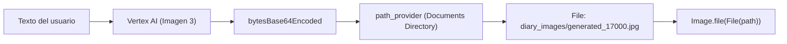

# 🎨 Agente 2: Generación Visual (`Imagen 3`)

Una de las características más atractivas de una aplicación agéntica es su capacidad para **crear contenido multimedia original** que complemente la experiencia del usuario.

En VoiceFlow Diary, si el usuario escribe una nota pero no tiene ninguna foto que adjuntar, el agente visual crea una ilustración artística personalizada usando **Google Imagen 3.0**.

---

## 🖌️ 1. Inicializar el Modelo de Imagen

Dentro del SDK `firebase_ai`, la generación visual se gestiona a través del método `imagenModel`:

```dart
import 'package:firebase_ai/firebase_ai.dart';
import 'package:example/config/ia/models/ia_models.dart';

class AIImageGenerator {
  final ImagenModel _model = FirebaseAI.vertexAI().imagenModel(
    model: IAModels.imageModelGemini, // 'imagen-3.0-generate-002'
    generationConfig: const ImagenGenerationConfig(
      numberOfImages: 1,
    ),
  );
}
```

---

## ✍️ 2. El Prompt Visual para el Diario

Para que la imagen coincida con la atmósfera de un diario íntimo, construimos un prompt que define tanto el **contenido** como el **estilo artístico**:

```dart
String _buildImagePrompt(String content, String? title) {
  // Tomamos los primeros 200 caracteres para no saturar el prompt
  final summary = content.length > 200 ? content.substring(0, 200) : content;

  return '''
Create a beautiful, artistic illustration that captures the essence of this diary entry.

${title != null && title.isNotEmpty ? 'Title: $title\n' : ''}
Content: $summary

Style: Minimalist, warm colors, dreamy atmosphere, suitable for a personal diary.
Focus on mood and emotions rather than literal representation.
''';
}
```

:::tip Truco de Prompt Engineering
Especificar un estilo consistente como *"Minimalist, warm colors, dreamy atmosphere"* evita que las imágenes se vean genéricas o dispersas, dándole una identidad estética profesional a tu aplicación.
:::

---

## 💾 3. De la Nube al Almacenamiento Local del Teléfono

El servicio devuelve la imagen en formato de bytes binarios. El agente realiza los siguientes pasos para persistirla localmente:



### Implementación en Dart:

```dart
Future<String?> generateImage({
  required String content,
  String? title,
}) async {
  try {
    final prompt = _buildImagePrompt(content, title);
    
    // 1. Llamar a Imagen 3
    final response = await _model.generateImages(prompt);

    if (response.images.isEmpty) return null;

    // 2. Extraer los bytes decodificados
    final imageBytes = response.images.first.bytesBase64Encoded;

    // 3. Obtener el directorio de documentos de la app
    final directory = await getApplicationDocumentsDirectory();
    final imagesDir = Directory('${directory.path}/diary_images');
    if (!await imagesDir.exists()) {
      await imagesDir.create(recursive: true);
    }

    // 4. Guardar archivo en disco con timestamp único
    final fileName = 'generated_${DateTime.now().millisecondsSinceEpoch}.jpg';
    final filePath = path.join(imagesDir.path, fileName);
    final file = File(filePath);
    await file.writeAsBytes(imageBytes);

    return filePath; // Retorna la ruta lista para SQLite y la UI
  } catch (e) {
    debugPrint('Error en generateImage: $e');
    return null;
  }
}
```

---

## 📱 4. Integración en la Pantalla de Creación (`new_entry_page.dart`)

Al momento de guardar la entrada:

```dart
// Si el usuario no adjuntó fotos manualmente, el agente genera una
if (finalImagePaths.isEmpty) {
  final generatedImagePath = await _diaryAgent.generateImage(
    content: content,
    title: _titleController.text.trim(),
  );
  if (generatedImagePath != null) {
    finalImagePaths.add(generatedImagePath);
  }
}
```

En el siguiente capítulo veremos cómo construir el **Asistente de Comandos por Voz Tradicional**.
