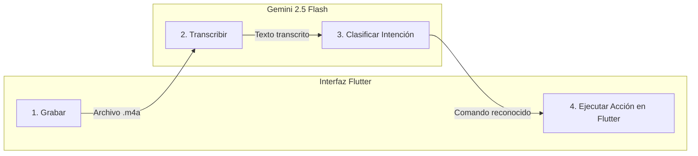

# 🎤 Agente 3: Comandos de Voz Clásicos

El **Asistente de Voz Tradicional** (`VoiceAssistantAgent`) es el patrón perfecto cuando deseas que el usuario dé órdenes discretas mediante su voz, tales como:
- *"Pon la aplicación de color azul"*
- *"¿Qué he escrito hoy?"*
- *"Elimina la última entrada"*
- *"¿Cómo puedo mejorar mi estado de ánimo?"*

---

## 🔄 El Pipeline de 4 Pasos

Este agente funciona mediante un flujo determinista y fácil de depurar:



1. **Grabar:** El paquete `record` captura el audio del micrófono a un archivo temporal.
2. **Transcribir:** `DiaryAgent.transcribeAudio()` convierte el archivo de voz a texto.
3. **Clasificar:** Gemini analiza la intención del usuario y clasifica la petición en una categoría.
4. **Ejecutar:** Flutter ejecuta el cambio de estado (`AppState`) o la consulta a la base de datos (`DiaryRepository`).

---

## 🏷️ Clasificación de Intenciones (Intent Classification)

En lugar de intentar que la IA haga todo en una sola respuesta, primero le pedimos clasificar la orden en una categoría clara:

```dart
enum VoiceCommandType {
  changeColor,
  answerQuestion,
  summarize,
  deleteEntry,
  unknown,
}

Future<VoiceCommandType> _classifyCommand(String transcription) async {
  final prompt = '''
Clasifica el siguiente comando de voz en una de estas categorías:

1. CHANGE_COLOR: Usuario quiere cambiar el color/tema de la aplicación
2. ANSWER_QUESTION: Usuario hace una pregunta general
3. SUMMARIZE: Usuario quiere un resumen de sus entradas
4. DELETE_ENTRY: Usuario quiere eliminar una entrada
5. UNKNOWN: No encaja en ninguna categoría

Comando: "$transcription"

Responde SOLO con una de estas palabras: CHANGE_COLOR, ANSWER_QUESTION, SUMMARIZE, DELETE_ENTRY, UNKNOWN
''';

  final response = await _gemini.generateContent([Content.text(prompt)]);
  final result = response.text?.trim().toUpperCase() ?? 'UNKNOWN';

  if (result.contains('CHANGE_COLOR')) return VoiceCommandType.changeColor;
  if (result.contains('ANSWER_QUESTION')) return VoiceCommandType.answerQuestion;
  if (result.contains('SUMMARIZE')) return VoiceCommandType.summarize;
  if (result.contains('DELETE_ENTRY')) return VoiceCommandType.deleteEntry;
  return VoiceCommandType.unknown;
}
```

---

## 🦾 Ejecución de Acciones: Modificando el Estado de Flutter

Una vez clasificado el comando, ejecutamos la función correspondiente.

### Ejemplo: Comando de Cambio de Color
El usuario puede decir: *"Pon la app en morado"* o *"Quiero un tono turquesa"*. Gemini extrae el color y lo mapeamos a la paleta de Flutter:

```dart
Future<VoiceCommandResult> _handleColorChange(String transcription) async {
  final prompt = '''
El usuario quiere cambiar el color de la aplicación.
Comando: "$transcription"

Elige UN color de esta lista: blue, red, green, purple, orange, pink, teal, indigo, brown, amber.
Responde SOLO con el nombre del color en inglés.
''';

  final response = await _gemini.generateContent([Content.text(prompt)]);
  final colorName = response.text?.trim().toLowerCase() ?? 'blue';

  final color = _getColorFromName(colorName);

  return VoiceCommandResult(
    type: VoiceCommandType.changeColor,
    message: 'Color cambiado a $colorName',
    success: true,
    data: {'color': color, 'colorName': colorName},
  );
}
```

En la UI, el botón de voz recibe este resultado y actualiza el `AppState`:

```dart
// example/lib/ui/widgets/voice_assistant_button.dart
if (result.type == VoiceCommandType.changeColor) {
  final color = result.data?['color'] as Color?;
  if (color != null && mounted) {
    Provider.of<AppState>(context, listen: false).setAppColor(color);
  }
}
```

¡Toda la interfaz cambia de color de inmediato de manera reactiva!

---

## ⚖️ ¿Cuándo conviene usar este patrón?

- **Ventajas:**
  - Consume muy pocos tokens.
  - Funciona con conexiones lentas o inestables.
  - El usuario tiene control total sobre cuándo empieza y termina la orden.
- **Desventaja:**
  - La interacción no es una conversación fluida, sino órdenes individuales.

En el próximo capítulo daremos el salto cuántico hacia la **conversación por voz en tiempo real con Gemini Live API**.
