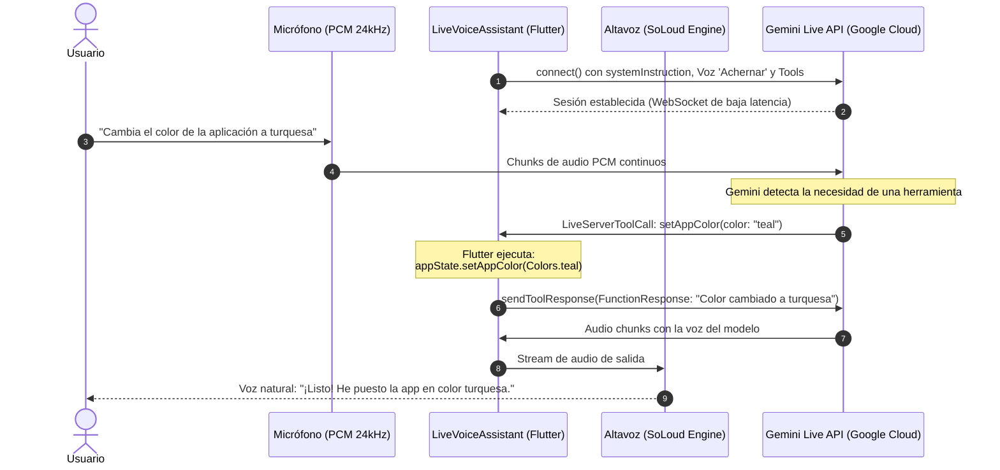

# 🔮 Agente 4: Tiempo Real con Gemini Live

Llegamos a la característica más avanzada y revolucionaria de la aplicación: **Gemini Live API**.

A diferencia del flujo tradicional de "grabar y esperar", con Gemini Live estableces una **conversación continua en tiempo real** por voz: hablas con naturalidad y la IA te responde hablando con una voz humana expresiva en español, mientras ejecuta herramientas dentro de la aplicación.

---

## ⚡ ¿Cómo funciona la arquitectura Live?



---

## 🛠️ 1. Configuración del Modelo Live

En `live_voice_assistant.dart`, inicializamos `LiveGenerativeModel`:

```dart
_liveModel = FirebaseAI.vertexAI().liveGenerativeModel(
  model: IAModels.liveModelGemini, // 'gemini-live-2.5-flash-native-audio'
  systemInstruction: Content.text('''
Eres un asistente personal inteligente para una aplicación de diario.
Hablas español de forma natural, amigable y conversacional.

CAPACIDADES:
1. Cambiar el color/tema de la aplicación
2. Responder preguntas sobre cualquier tema
3. Crear resúmenes de las entradas del diario
4. Eliminar entradas

REGLA CRÍTICA:
Después de ejecutar CUALQUIER herramienta (function call), SIEMPRE debes
responder de inmediato al usuario por voz comunicando el resultado.
  '''),
  liveGenerationConfig: LiveGenerationConfig(
    speechConfig: SpeechConfig(
      voiceName: 'Achernar', // Voz fluida en español
    ),
    responseModalities: [ResponseModalities.audio],
  ),
  tools: [
    Tool.functionDeclarations([
      _buildChangeColorTool(),
      _buildGetSummaryTool(),
      _buildDeleteEntryTool(),
    ]),
  ],
);
```

:::warning El Nombre del Modelo Importa
Para la Live API no puedes usar `gemini-2.5-flash`. Debes usar un modelo nativo de audio como `gemini-live-2.5-flash-native-audio`, de lo contrario la sesión conectará pero nunca emitirá audio de respuesta.
:::

---

## 🎙️ 2. Audio: Captura y Reproducción en Streaming

Para lograr latencia instantánea se requieren dos motores sincronizados:

### A. Entrada (Micrófono PCM 24kHz)
Usamos `record` configurado con frecuencia de muestreo de 24.000 Hz en formato PCM de 16 bits mono:

```dart
final recordConfig = RecordConfig(
  encoder: AudioEncoder.pcm16bits,
  sampleRate: 24000,
  numChannels: 1,
  echoCancel: true,
  noiseSuppress: true,
  autoGain: true,
);

final audioStream = await _recorder.startStream(recordConfig);
```

### B. Salida (Motor de audio SoLoud)
Inicializamos `flutter_soloud` para reproducir el stream continuo que la IA envía:

```dart
await SoLoud.instance.init(sampleRate: 24000, channels: Channels.mono);
final source = SoLoud.instance.setBufferStream(
  bufferingType: BufferingType.released,
  bufferingTimeNeeds: 0.1,
);
_audioSource = source;
_soundHandle = await SoLoud.instance.play(source);
```

Cuando Gemini envía un paquete de audio, simplemente lo agregamos al buffer:

```dart
void _playAudioPart(InlineDataPart part) {
  if (part.mimeType.contains('audio')) {
    SoLoud.instance.addAudioDataStream(_audioSource!, part.bytes);
  }
}
```

---

## 🦾 3. Declaración de Herramientas (Tools)

Cada herramienta se describe formalmente con `FunctionDeclaration`:

```dart
FunctionDeclaration _buildChangeColorTool() {
  return FunctionDeclaration(
    'setAppColor',
    'Cambia el color primario de la aplicación',
    parameters: {
      'color': Schema.string(
        description: 'Nombre del color en inglés: blue, red, green, purple, teal...',
      ),
    },
  );
}

FunctionDeclaration _buildGetSummaryTool() {
  return FunctionDeclaration(
    'getDiarySummary',
    'Obtiene un resumen de las entradas del diario',
    parameters: {
      'timeRange': Schema.string(
        description: 'Rango temporal: today, week, month, all',
      ),
    },
  );
}
```

---

## 🔄 4. El Bucle de Procesamiento de Mensajes y Tool Calls

Nos suscribimos al stream de la sesión abierta:

```dart
Future<void> _processMessagesContinuously() async {
  await for (final response in _session.receive()) {
    final message = response.message;

    // 1. Si el modelo está hablando, reproducimos su audio
    if (message is LiveServerContent) {
      final parts = message.modelTurn?.parts;
      if (parts != null) {
        for (final part in parts) {
          if (part is InlineDataPart) {
            _playAudioPart(part);
          }
        }
      }

      // 2. Si el usuario interrumpió al modelo (Barge-in), limpiamos el audio
      if (message.interrupted == true) {
        await _clearAudioBuffer();
      }
    }

    // 3. Si el modelo solicita ejecutar una herramienta (Function Calling)
    if (message is LiveServerToolCall && message.functionCalls != null) {
      for (final call in message.functionCalls!) {
        if (call.name == 'setAppColor') {
          final colorName = call.args['color']?.toString() ?? 'blue';
          final color = _getColorFromName(colorName);
          
          // Modificamos el estado de Flutter
          Provider.of<AppState>(context, listen: false).setAppColor(color);

          // Respondemos al modelo para que continúe hablando
          await _session.sendToolResponse([
            FunctionResponse(call.name, {
              'response': 'El color cambió a $colorName. Confirma al usuario en voz.',
            }),
          ]);
        }
      }
    }
  }
}
```

---

## ✋ 5. Manejo de Interrupciones ("Barge-in")

Si la IA está hablando y el usuario empieza a hablar de nuevo ("Espera, mejor ponlo en azul"), el servidor de Gemini envía la bandera `message.interrupted == true`.

En Flutter, detenemos el buffer de `SoLoud` y creamos un buffer limpio para que el audio anterior no se mezcle con la nueva respuesta:

```dart
Future<void> _clearAudioBuffer() async {
  if (_audioSource != null && _soundHandle != null) {
    SoLoud.instance.setDataIsEnded(_audioSource!);
    await SoLoud.instance.stop(_soundHandle!);
    await _setupAudioOutput(); // Nuevo buffer limpio
  }
}
```

¡Ahora tienes un asistente conversacional real en tu bolsillo! En el siguiente capítulo aprenderás a crear tus propias herramientas personalizadas.
