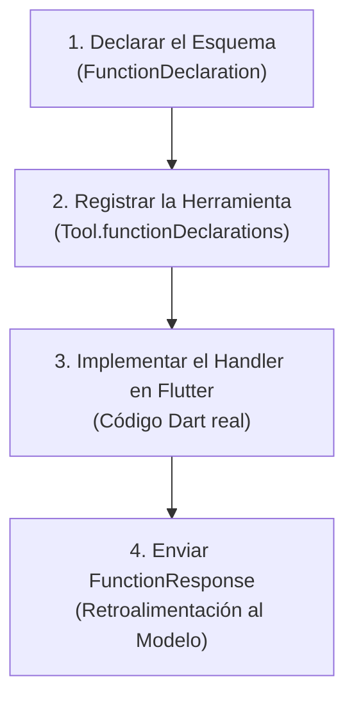

# 🛠️ Cómo Crear Tus Propias Herramientas

La verdadera magia de las aplicaciones agénticas radica en su capacidad de ampliación. Puedes enseñarle a tu agente a interactuar con **cualquier API de Flutter**, base de datos, servicio REST o sensor del dispositivo.

En este capítulo aprenderás la **fórmula universal de 4 pasos** para añadir una nueva herramienta a tu agente.

---

## 🧪 La Fórmula de 4 Pasos



---

## 🎯 Ejemplo Práctico: Herramienta `searchDiaryEntries`

Imaginemos que queremos que el usuario pueda decir:  
> *"Busca en mis notas si mencioné mi viaje a Japón"*

### Paso 1: Declarar el Esquema
Definimos el nombre, la descripción y los parámetros que el modelo debe proporcionar:

```dart
FunctionDeclaration _buildSearchDiaryTool() {
  return FunctionDeclaration(
    'searchDiaryEntries',
    'Busca entradas del diario que coincidan con una palabra clave o tema',
    parameters: {
      'query': Schema.string(
        description: 'La palabra clave o concepto a buscar en las notas',
      ),
      'limit': Schema.integer(
        description: 'Número máximo de notas a devolver (por defecto 5)',
        nullable: true,
      ),
    },
  );
}
```

:::tip Regla de Oro en Descripciones
El modelo utiliza la descripción para decidir **cuándo** llamar a la función. Escribe descripciones claras y directas sobre el propósito de la herramienta.
:::

---

### Paso 2: Registrar en el Modelo
Agrega tu nueva declaración a la lista de herramientas en tu agente:

```dart
final model = FirebaseAI.vertexAI().generativeModel(
  model: IAModels.chatModelGemini,
  tools: [
    Tool.functionDeclarations([
      _buildChangeColorTool(),
      _buildGetSummaryTool(),
      _buildSearchDiaryTool(), // 👈 Nueva herramienta añadida
    ]),
  ],
);
```

---

### Paso 3: Implementar el Handler en Flutter
Escribe el método Dart que consulta tu repositorio o base de datos local:

```dart
Future<void> _handleSearchEntries(FunctionCall call) async {
  // 1. Extraer los argumentos generados por la IA
  final query = call.args['query']?.toString() ?? '';
  final limit = int.tryParse(call.args['limit']?.toString() ?? '5') ?? 5;

  // 2. Ejecutar la búsqueda en SQLite
  final results = await _repository.searchEntries(query: query, limit: limit);

  // 3. Preparar la respuesta de la herramienta
  Map<String, dynamic> responseData;

  if (results.isEmpty) {
    responseData = {
      'found': false,
      'message': 'No se encontraron notas con la palabra clave "$query".',
    };
  } else {
    final listPreview = results
        .map((e) => '- ${e.formattedDate}: ${e.title} (${e.contentPreview})')
        .join('\n');

    responseData = {
      'found': true,
      'count': results.length,
      'entries': listPreview,
      'instruction': 'Resume estos hallazgos de forma amigable y natural.',
    };
  }

  // Paso 4: Devolver la respuesta a la sesión de la IA
  await _session.sendToolResponse([
    FunctionResponse(call.name, responseData),
  ]);
}
```

---

### Paso 4: Enlazar en el Switch de Tool Calls

En el bucle de recepción de eventos del agente:

```dart
switch (call.name) {
  case 'setAppColor':
    await _handleColorChange(call);
    break;
  case 'searchDiaryEntries':
    await _handleSearchEntries(call); // 👈 Tu nuevo controlador
    break;
  default:
    debugPrint('Herramienta desconocida: ${call.name}');
}
```

---

## 🛡️ Buenas Prácticas al Crear Herramientas

1. **Confirmación en Operaciones Destructivas**:
   - Si tu herramienta elimina datos (`deleteEntry`, `clearHistory`), instruye al modelo en el prompt a pedir confirmación al usuario antes de ejecutar la llamada.
2. **Manejo de Errores Defensivo**:
   - Siempre encierra la ejecución de tu herramienta en un bloque `try / catch`. Si la base de datos falla, devuelve un `FunctionResponse` con `'error': 'No se pudo acceder a la base de datos'`. Así el modelo podrá explicárselo cortésmente al usuario en lugar de colgarse.
3. **Respuestas Concisas en JSON**:
   - No envíes datos gigantescos en el `FunctionResponse`. Envía solo la información esencial que la IA necesita para responderle al usuario humano.

En el siguiente capítulo revisaremos buenas prácticas de producción, costos y preguntas frecuentes.
