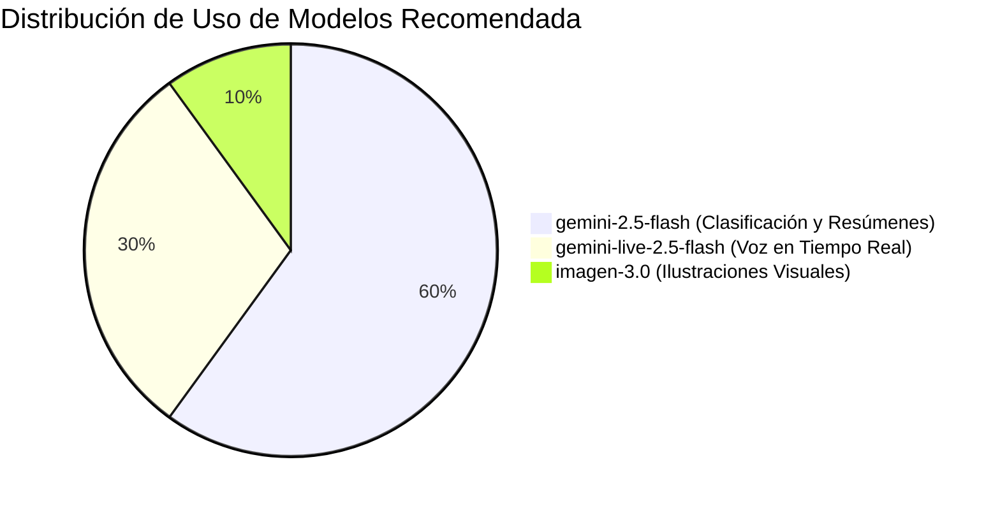

# 💡 Buenas Prácticas y Preguntas Frecuentes

Llevar una aplicación agéntica a producción requiere cuidar tres factores esenciales: **Seguridad**, **Costos y Rendimiento**, y **Experiencia de Usuario (UX)**.

---

## 🔒 1. Seguridad: Protege tu Aplicación

### Nunca expongas Claves de API en el Cliente
En aplicaciones tradicionales que consumen APIs directas de IA, los desarrolladores suelen cometer el error de incluir `GEMINI_API_KEY="AIzaSy..."` en el código de Flutter. Cualquier persona con herramientas de descompilación puede extraer esa clave y consumir tu cuota.

### La Ventaja de Firebase Vertex AI
Con `firebase_ai`, la autenticación se realiza mediante la infraestructura segura de Firebase:
- No hay ninguna API key de Gemini expuesta en los binarios compilados.
- Puedes activar **Firebase App Check** para garantizar que únicamente solicitudes legítimas provenientes de tu app real en Android o iOS puedan comunicarse con Vertex AI.

---

## 💰 2. Optimización de Costos y Rendimiento

1. **Usa `gemini-2.5-flash` como tu modelo predeterminado**: Es extremadamente rápido, económico y suficiente para el 95% de las tareas de análisis y clasificación de intenciones.
2. **Trunca o resume contenidos gigantes**: Si vas a pedir un resumen de una nota, no envíes 50 páginas de texto innecesario.
3. **Controla las imágenes**: Limita a un máximo de 2 o 3 imágenes de tamaño optimizado al llamar a análisis multimodal (`InlineDataPart`).
4. **Push-to-Talk en la Live API**: En `live_voice_assistant.dart`, implementamos un mecanismo donde el streaming de voz real solo se transmite mientras el usuario mantiene presionado el botón. Esto ahorra ancho de banda y consumo de cuota cuando hay silencio ambiental.

---

## 🎨 3. Experiencia de Usuario (UX)

Las aplicaciones de IA necesitan comunicar visualmente qué está ocurriendo en cada momento:

- **Feedback Inmediato**: Usa animaciones sutiles (pulsos o cambios de color) para indicar que el micrófono está activo.
- **Evita el silencio incómodo**: En las instrucciones del sistema del agente, indícale siempre que tras ejecutar una herramienta hable de inmediato para confirmar el resultado.
- **Tolerancia a fallos**: Si la conexión a internet cae, la app debe seguir permitiendo escribir y guardar notas en SQLite de manera offline.

---

## ❓ Preguntas Frecuentes (FAQ)

### ¿Esta arquitectura funciona en Web, iOS y Android?
**Sí.** Flutter compila a todas las plataformas. `record` y `flutter_soloud` soportan dispositivos móviles y de escritorio. En Web, asegúrate de configurar los permisos de micrófono del navegador.

### ¿Puedo cambiar el idioma o el acento de la voz en tiempo real?
Sí. En la configuración de `LiveGenerationConfig(speechConfig: SpeechConfig(voiceName: '...'))`, puedes elegir distintas voces del catálogo de Gemini Live. `Achernar` ofrece una pronunciación natural y cálida en español.

### ¿Puedo hacer que varios agentes colaboren entre sí?
Totalmente. Puedes tener un agente supervisor que clasifique la petición y delegue la tarea al `DiaryAgent` o a un agente de búsqueda especializado.

---

## 🏁 ¡Felicidades!
Has completado la guía de implementación de aplicaciones agénticas con Flutter. Ahora estás listo para explorar el código en el directorio `example/` y crear tus propios agentes inteligentes. 🚀
