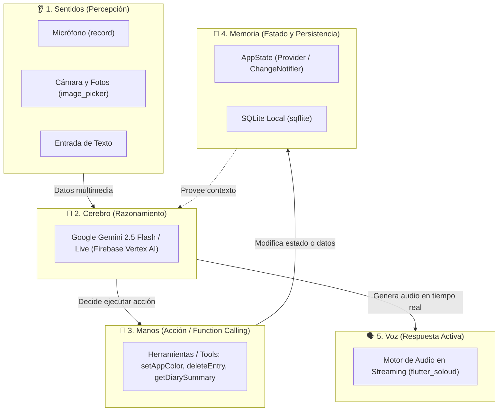

# 🌟 Introducción a Flutter Agéntico

¡Bienvenido! Si alguna vez te has preguntado cómo crear aplicaciones móviles o web que no solo muestren información, sino que **piensen, tomen decisiones y ejecuten acciones** por el usuario, estás en el lugar correcto.

Esta guía está diseñada para que cualquier desarrollador (incluso si eres completamente nuevo en el mundo de la Inteligencia Artificial) pueda comprender e implementar **aplicaciones agénticas con Flutter**, tomando como referencia práctica el proyecto real **VoiceFlow Diary** incluido en este repositorio.

---

## 🤖 ¿Qué es una "Aplicación Agéntica"?

Para entenderlo de la forma más simple, comparemos una aplicación tradicional, un chatbot con IA y una **App Agéntica**:

| Tipo de App | ¿Cómo funciona? | Analogía |
| :--- | :--- | :--- |
| **App Tradicional** | El usuario presiona botones y la app ejecuta código predeterminado. | Un control remoto. |
| **Chatbot Tradicional** | El usuario escribe una pregunta y la IA responde con texto plano. | Una enciclopedia interactiva. |
| **App Agéntica (Agentic App)** | La IA **comprende** la intención, **decide** un plan y **ejecuta acciones reales** en la aplicación (cambia temas, guarda datos, borra registros, genera imágenes). | **Un copiloto inteligente con manos y sentidos.** |

:::tip La Regla de Oro de un Agente
Un modelo de lenguaje normal solo **habla**.  
Un **Agente de IA** tiene **agencia**: puede **percibir** su entorno, **razonar** sobre qué hacer y **actuar** llamando a funciones de tu código en Flutter.
:::

---

## 🧩 La Anatomía de un Agente en Flutter

Imagina a un agente de IA como un ser vivo compuesto por 5 partes fundamentales dentro de Flutter:

1. **🧠 El Cerebro**: **Google Gemini 2.5 Flash y Gemini Live**, a través del paquete oficial `firebase_ai`. Analiza lo que el usuario quiere y toma decisiones.
2. **👂 Los Sentidos**: Capturan información del mundo real: el micrófono grabando streams de audio (`record`), la cámara o galería (`image_picker`).
3. **🦾 Las Manos (Function Calling)**: Herramientas que tú le das a la IA. La IA puede invocar funciones Dart reales para interactuar con la app.
4. **💾 La Memoria**: El estado reactivo de la aplicación (`AppState`) y la base de datos local SQLite (`sqflite`), que guardan las entradas del diario y las preferencias.
5. **🗣️ La Voz**: Síntesis de voz nativa ultra rápida que transmite audio continuo al altavoz usando `flutter_soloud`.

---

## 📱 ¿Qué hace el proyecto VoiceFlow Diary?

El proyecto de ejemplo es **VoiceFlow Diary**, un diario personal inteligente que demuestra 3 modalidades de agentes en acción:

1. **Agente de Análisis Multimodal (`DiaryAgent`)**: Analiza tus notas y fotos para detectar automáticamente tus emociones, extraer temas clave, generar resúmenes y crear ilustraciones artísticas con Imagen 3.
2. **Asistente de Voz Tradicional (`VoiceAssistantAgent`)**: Graba tu voz, la transcribe, clasifica lo que pides y ejecuta el comando (por ejemplo, cambiar el color del tema).
3. **Asistente en Tiempo Real (`LiveVoiceAssistant`)**: Conversación por voz bidireccional y fluida con **Gemini Live API**. Hablas y te responde al instante en español mientras ejecuta herramientas en vivo.

---

## 🗺️ Mapa de la Guía

Para acompañarte paso a paso, hemos dividido esta documentación en capítulos cortos y prácticos:

- **[Conceptos Clave](01-core-concepts.md)**: Cómo funciona el Function Calling y el streaming en Flutter.
- **[Instalación y Configuración](02-quick-start.md)**: Configura Firebase Vertex AI y las dependencias.
- **[Arquitectura](03-architecture.md)**: Cómo organizar el código para mantenerlo limpio y escalable.
- **[Agente 1: Análisis de Contenido](04-diary-agent.md)**: Sentimiento, etiquetas y resúmenes automáticos.
- **[Agente 2: Generación Visual](05-image-generation.md)**: Ilustraciones personalizadas con Imagen 3.
- **[Agente 3: Asistente Tradicional](06-voice-assistant.md)**: Pipeline de grabación, transcripción y comandos.
- **[Agente 4: Agente en Tiempo Real (Live API)](07-live-agent.md)**: Conversaciones de voz con latencia sub-segundo y llamadas a herramientas en caliente.
- **[Crea tus Propias Herramientas](08-custom-tools.md)**: Dale nuevos superpoderes a tu agente.
- **[Buenas Prácticas y FAQ](09-faq-best-practices.md)**: Consejos de producción, costos y seguridad.

¡Comencemos el viaje hacia el desarrollo de aplicaciones agénticas! 🚀
