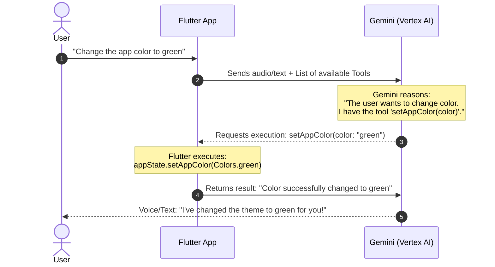
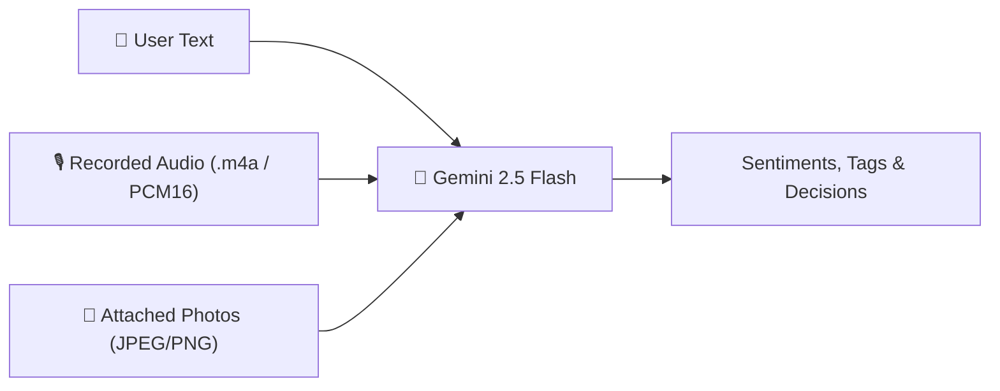
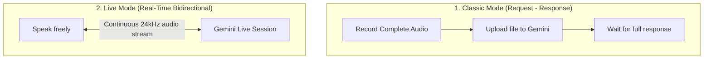

# 🧠 Core Concepts

Before writing code, it is critical to understand the **3 foundational pillars** that turn a traditional language model into an **interactive Flutter agent**:

1. **Function Calling (Tools)**
2. **Native Multimodality (Text, Audio, and Images)**
3. **Real-Time Bidirectional Streaming (Live API)**

---

## 1. What is Function Calling?

Traditionally, when you ask an AI model something, it only returns raw text:
> **User:** *"Please change my app theme color to green"*  
> **Standard AI:** *"Done! I changed your app color to green."* (A lie! Nothing actually changed because it has no access to your device).

With **Function Calling**, the AI becomes an active operator of your application:



### How does the AI know what functions exist?
You supply the model with a "menu of tools" (`Tool.functionDeclarations`). Each tool describes:
- **Name:** E.g., `setAppColor`
- **Natural language description:** *"Changes the primary color of the application"*
- **Expected parameters:** A string representing the English color name.

The model **does not execute code directly** (for security reasons). Instead, the model tells your app: *"Hey Flutter, please run `setAppColor` with argument `green`"*. Your Flutter code executes locally and returns the result back to the model.

---

## 2. Multimodality: Beyond Text

A modern agent does not only read text strings. In this project, Gemini interacts with three modalities simultaneously:



In Flutter using the `firebase_ai` SDK, sending an image or audio file alongside text is as simple as using an `InlineDataPart`:

```dart
// Send text and a photo together to Gemini
final response = await geminiModel.generateContent([
  Content.multi([
    TextPart('What emotion does this photo and text convey?'),
    InlineDataPart('image/jpeg', imageBytes),
  ]),
]);
```

---

## 3. Bidirectional Streaming vs Classic Request-Response

Flutter applications can communicate with Gemini in two distinct ways:



### Classic Mode (Standard Voice Command)
- **Workflow:** Tap to record ➔ speak ➔ tap to stop ➔ wait 1-2 seconds ➔ receive answer.
- **Best for:** Long audio transcription, batch summaries, or background processing when saving an entry.

### Live Mode (Gemini Live API)
- **Workflow:** Establish an active bidirectional connection with `gemini-live-2.5-flash-native-audio`.
- As you speak, your microphone sends continuous audio chunks (PCM at 24,000 Hz).
- Before you even take a breath, the model is already streaming back its voice response.
- If you interrupt the model ("Wait, stop!"), the model detects the interruption (**Barge-in**) and immediately stops speaking.

---

## 4. Connecting the Agent to Flutter State

The hallmark of a well-architected agentic Flutter app is keeping AI logic decoupled from UI widgets:

- **The UI:** Listens to state changes using `Provider` or `ChangeNotifier`.
- **The Agent:** Interacts with Gemini and, when an action is required, modifies `AppState` or the SQLite database.
- **The Result:** The UI updates reactively and seamlessly.

In the next chapter, we will set up the environment step-by-step.
