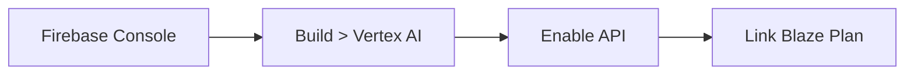

# 🚀 Quick Start & Setup

To build and run agentic applications with Vertex AI in Flutter, you need to prepare your development environment. This guide walks you through the exact prerequisites and Firebase configuration.

---

## 🛠️ 1. Prerequisites

Make sure you have installed:

- **Flutter SDK**: Version `3.10.1` or higher ([Install Flutter](https://docs.flutter.dev/get-started/install)).
- **Node.js**: Required for Firebase command line tools.
- **FlutterFire CLI**: The official tool to configure Firebase in Flutter.
  ```bash
  dart pub global activate flutterfire_cli
  ```

---

## ☁️ 2. Enable Vertex AI in Firebase

Firebase Vertex AI gives your Flutter app direct access to Gemini and Imagen models through Google Cloud's secure infrastructure without exposing your private API keys in client-side code.

1. Navigate to the [Firebase Console](https://console.firebase.google.com/) and create or select a project.
2. In the left navigation menu, go to **Build > Vertex AI in Firebase**.
3. Click **Get Started** to enable the Vertex AI APIs.
4. **Important:** Ensure your project is linked to the **Blaze (Pay as you go)** plan. Vertex AI offers a generous free tier for development and testing.



---

## 📲 3. Link Firebase to your Flutter App

Open your terminal in the `example/` directory and run:

```bash
cd example
flutterfire configure
```

- Select your Firebase project.
- Choose the target platforms (Android, iOS, Web, macOS).
- This automatically generates your configuration in `lib/firebase_options.dart`.

:::note Path in this repository
In VoiceFlow Diary, the options file is located at `lib/config/firebase/firebase_options.dart`. Update references if you generate a new configuration.
:::

---

## 📦 4. Key Dependencies in `pubspec.yaml`

The `example/pubspec.yaml` file relies on these core dependencies:

```yaml
dependencies:
  flutter:
    sdk: flutter

  # 🧠 Artificial Intelligence with Firebase Vertex AI
  firebase_core: ^4.3.0
  firebase_ai: ^3.6.1

  # 🎙️ Audio Input & Output
  record: ^6.1.2            # Microphone capture & PCM16 streaming
  flutter_soloud: ^3.4.7     # Low-latency C++ audio streaming engine
  audio_session: 0.2.2       # Audio focus management for iOS and Android

  # 💾 State & Local Database
  provider: ^6.1.5+1         # Reactive state management
  sqflite: ^2.4.1           # Local SQLite database
  path_provider: ^2.1.5     # Local filesystem directories

  # 📸 Media & Permissions
  image_picker: ^1.0.7       # Photo capture and selection
  permission_handler: ^11.3.0 # Runtime permission handling
```

Fetch all dependencies:

```bash
flutter pub get
```

---

## 🔒 5. System Permissions (Microphone & Camera)

Because agents hear and see, declare permissions in native configuration files:

### Android (`example/android/app/src/main/AndroidManifest.xml`)
```xml
<manifest ...>
    <uses-permission android:name="android.permission.RECORD_AUDIO" />
    <uses-permission android:name="android.permission.INTERNET" />
    <uses-permission android:name="android.permission.CAMERA" />
    <uses-permission android:name="android.permission.READ_MEDIA_IMAGES" />
</manifest>
```

### iOS (`example/ios/Runner/Info.plist`)
```xml
<dict>
    <key>NSMicrophoneUsageDescription</key>
    <string>VoiceFlow Diary needs microphone access to transcribe voice notes and talk with the live voice assistant.</string>
    <key>NSCameraUsageDescription</key>
    <string>Allows capturing photos to enrich your diary entries.</string>
    <key>NSPhotoLibraryUsageDescription</key>
    <string>Allows selecting photos from your photo gallery.</string>
</dict>
```

---

## ▶️ 6. Run the Application

Launch the app on your preferred platform:

```bash
# Run on Android
flutter run -d android

# Run on iOS
flutter run -d ios

# Run in Chrome
flutter run -d chrome

# Run on macOS desktop
flutter run -d macos
```

Your setup is complete! In the next chapter, we'll examine the app architecture.
