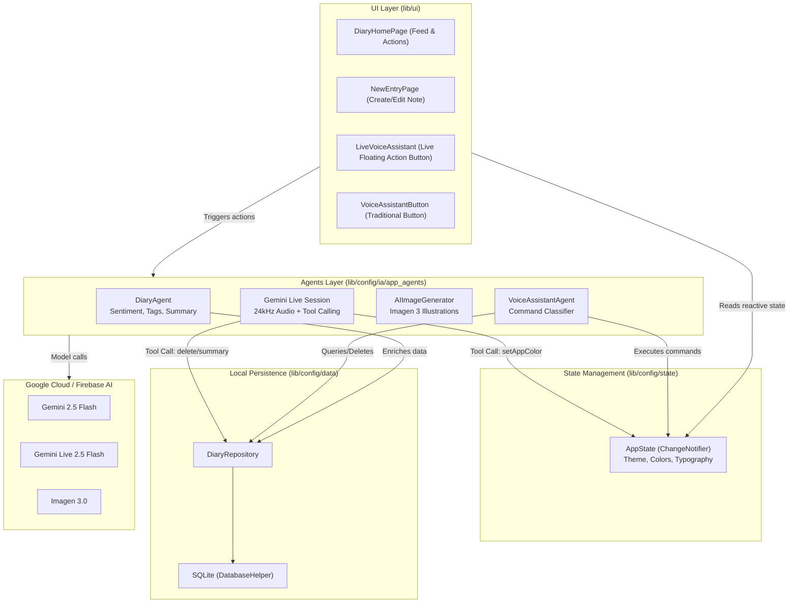

# 🏗️ Project Architecture & Structure

An agentic application requires a strict separation of concerns: UI widgets must not be burdened with prompt engineering or raw AI calls. This chapter explores how **VoiceFlow Diary** is structured to be modular, scalable, and easy to maintain.

---

## 📐 Global Architecture Diagram

Information follows a clean, reactive, unidirectional flow:



---

## 📁 Directory Structure

The code inside `example/lib` is structured as follows:

```text
example/lib/
├── config/
│   ├── app/
│   │   └── app.dart                 # MaterialApp & BetterFeedback configuration
│   ├── data/
│   │   ├── database_helper.dart     # SQLite connection & table schemas
│   │   └── diary_repository.dart   # CRUD operations for diary entries
│   ├── firebase/
│   │   └── firebase_options.dart    # FlutterFire generated credentials
│   ├── ia/
│   │   ├── app_agents/
│   │   │   ├── diary_agent.dart           # 🧠 Multimodal analysis agent
│   │   │   ├── voice_assistant_agent.dart # 🎤 Discrete command assistant
│   │   │   └── image_generator.dart       # 🎨 Cover illustration generator
│   │   └── models/
│   │       └── ia_models.dart       # Centralized model constants
│   ├── models/
│   │   └── diary_entry.dart         # Data model with Sentiment & Tags
│   └── state/
│       └── app_state.dart           # Reactive app state (theme & palette)
├── ui/
│   ├── pages/
│   │   ├── diary_home_page.dart     # Home feed with entry cards
│   │   └── new_entry_page.dart      # Create/edit entry page
│   └── widgets/
│       ├── entry_card.dart          # Entry card widget
│       ├── live_voice_assistant.dart# 🔮 Real-time Gemini Live widget
│       ├── voice_assistant_button.dart# 🗣️ Traditional voice command button
│       └── voice_command_button.dart  # 🎙️ Dictation recording button
└── main.dart                        # Application entry point
```

---

## 🎯 Centralized Model Configuration (`ia_models.dart`)

Instead of hardcoding model names across widgets and services, declare them in a central configuration class:

```dart
// example/lib/config/ia/models/ia_models.dart
class IAModels {
  IAModels._();

  /// Fast reasoning, classification, and multimodal text/vision analysis
  static const String chatModelGemini = 'gemini-2.5-flash';

  /// High quality visual illustration generation
  static const String imageModelGemini = 'imagen-3.0-generate-002';

  /// Real-time bidirectional streaming audio (Live API).
  /// Must use a native audio model to avoid silent sessions.
  static const String liveModelGemini = 'gemini-live-2.5-flash-native-audio';
}
```

---

## 🤝 The Multi-Agent Pattern

Rather than forcing one monolithic model to perform every conceivable task with a single unwieldy prompt, the project splits tasks among **specialized agents**:

| Agent | Core Responsibility | Model |
| :--- | :--- | :--- |
| **DiaryAgent** | Analyzes emotions, tags content, and generates summaries. | `gemini-2.5-flash` |
| **AIImageGenerator** | Generates artwork matching the mood and context. | `imagen-3.0-generate-002` |
| **VoiceAssistantAgent** | Classifies voice intent and executes discrete actions. | `gemini-2.5-flash` |
| **LiveVoiceAssistant** | Interactive real-time conversational agent with tools. | `gemini-live-2.5-flash-native-audio` |

In the upcoming chapters, we'll build each agent from the ground up.
