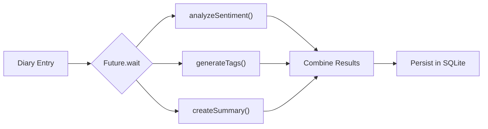

# 📝 Agent 1: Multimodal Analysis (`DiaryAgent`)

The first agent we build is the **`DiaryAgent`**. Its role is to serve as a personal editor and psychologist: whenever the user writes an entry or attaches photos, the agent processes all media to:

1. Detect the **emotional sentiment** (from very positive to negative).
2. Generate 2 to 5 **smart tags**.
3. Create a **concise summary** if the entry is long.
4. Transcribe recorded voice notes into text.

---

## 🛠️ 1. Initializing the Agent

We instantiate a Singleton class that sets up `gemini-2.5-flash` using `firebase_ai`:

```dart
import 'package:firebase_ai/firebase_ai.dart';
import 'package:example/config/ia/models/ia_models.dart';

class DiaryAgent {
  static final DiaryAgent _instance = DiaryAgent._internal();
  factory DiaryAgent() => _instance;
  DiaryAgent._internal();

  // Generative multimodal model instance
  final _gemini = FirebaseAI.vertexAI().generativeModel(
    model: IAModels.chatModelGemini,
  );
}
```

---

## 🎭 2. Multimodal Sentiment Analysis

A key trait of an agentic Flutter app is that it doesn't just evaluate text; it **inspects attached photos** to capture complete context:

```dart
Future<Sentiment> analyzeSentiment({
  required String content,
  String? title,
  List<String>? imagePaths,
}) async {
  try {
    // 1. Build structured prompt
    final prompt = _buildSentimentPrompt(content, title);
    final parts = <Part>[TextPart(prompt)];

    // 2. Attach up to 3 photos as JPEG bytes
    if (imagePaths != null && imagePaths.isNotEmpty) {
      for (var i = 0; i < imagePaths.length && i < 3; i++) {
        final imageFile = File(imagePaths[i]);
        if (await imageFile.exists()) {
          final bytes = await imageFile.readAsBytes();
          parts.add(InlineDataPart('image/jpeg', bytes));
        }
      }
    }

    // 3. Query Gemini
    final response = await _gemini.generateContent([Content.multi(parts)]);
    final text = response.text?.trim().toLowerCase() ?? '';

    // 4. Map string response to Dart Enum
    return _parseSentiment(text);
  } catch (e) {
    debugPrint('Error in analyzeSentiment: $e');
    return Sentiment.neutral;
  }
}
```

### The Structured Prompt
To ensure the AI returns a clean, parseable result without conversational filler, we mandate a single keyword response:

```dart
String _buildSentimentPrompt(String content, String? title) {
  return '''
Analyze the emotional sentiment of this diary entry.
${title != null && title.isNotEmpty ? 'Title: $title\n' : ''}
Content: $content

Reply ONLY with one of these exact words (no extra explanation):
- veryPositive: Joyful, excited, celebrating
- positive: Content, happy, optimistic, peaceful
- neutral: Balanced, reflective, descriptive
- negative: Sad, frustrated, anxious, annoyed
- veryNegative: Devastated, furious, hopeless
- mixed: Bitter-sweet, ambivalent, mixed feelings

Consider attached images if present.
''';
}
```

---

## ⚡ 3. Parallel Execution with `Future.wait`

Running sentiment analysis, tag extraction, and summarization sequentially would force the user to wait several seconds.

Instead, we use `Future.wait` to fire all 3 requests concurrently:



```dart
Future<Map<String, dynamic>> analyzeEntry(DiaryEntry entry) async {
  try {
    // All 3 tasks execute in parallel on Vertex AI
    final results = await Future.wait([
      analyzeSentiment(
        content: entry.content,
        title: entry.title,
        imagePaths: entry.imagePaths,
      ),
      generateTags(
        content: entry.content,
        title: entry.title,
        imagePaths: entry.imagePaths,
      ),
      createSummary(
        content: entry.content,
        title: entry.title,
      ),
    ]);

    return {
      'sentiment': results[0] as Sentiment,
      'tags': results[1] as List<String>,
      'summary': results[2] as String?,
    };
  } catch (e) {
    return {
      'sentiment': Sentiment.neutral,
      'tags': <String>[],
      'summary': null,
    };
  }
}
```

---

## 🎙️ 4. Audio Transcription with Gemini

Gemini can transcribe audio natively without requiring third-party STT cloud services.

Simply read the recorded audio file into bytes and pass it as an `InlineDataPart`:

```dart
Future<String?> transcribeAudio(String audioPath) async {
  final audioFile = File(audioPath);
  final bytes = await audioFile.readAsBytes();

  final prompt = '''
Transcribe the following audio into text.
- Write down exactly what is spoken.
- Use proper punctuation and capitalization.
- Reply ONLY with the transcribed text.
''';

  final response = await _gemini.generateContent([
    Content.multi([
      TextPart(prompt),
      InlineDataPart('audio/mp4', bytes),
    ]),
  ]);

  return response.text?.trim();
}
```

Next, we'll see how to generate artistic illustrations using Imagen 3 when entries lack photos.
