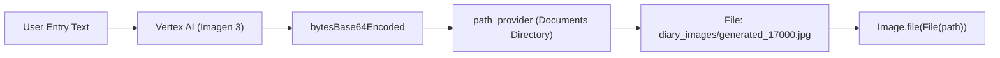

# 🎨 Agent 2: Visual Generation (`Imagen 3`)

A compelling dimension of an agentic app is its capability to **synthesize original multimedia assets** that enrich user experiences.

In VoiceFlow Diary, if the user writes an entry without attaching any photo, the visual agent steps in and creates a personalized illustration using **Google Imagen 3.0**.

---

## 🖌️ 1. Initializing the Image Model

In the `firebase_ai` SDK, image generation is configured via `imagenModel`:

```dart
import 'package:firebase_ai/firebase_ai.dart';
import 'package:example/config/ia/models/ia_models.dart';

class AIImageGenerator {
  final ImagenModel _model = FirebaseAI.vertexAI().imagenModel(
    model: IAModels.imageModelGemini, // 'imagen-3.0-generate-002'
    generationConfig: const ImagenGenerationConfig(
      numberOfImages: 1,
    ),
  );
}
```

---

## ✍️ 2. Crafting the Visual Prompt

To ensure generated images fit the reflective atmosphere of a personal journal, we formulate a prompt that specifies both **content** and **artistic style**:

```dart
String _buildImagePrompt(String content, String? title) {
  // Take the first 200 characters to prevent prompt saturation
  final summary = content.length > 200 ? content.substring(0, 200) : content;

  return '''
Create a beautiful, artistic illustration that captures the essence of this diary entry.

${title != null && title.isNotEmpty ? 'Title: $title\n' : ''}
Content: $summary

Style: Minimalist, warm colors, dreamy atmosphere, suitable for a personal diary.
Focus on mood and emotions rather than literal representation.
''';
}
```

:::tip Prompt Engineering Tip
Providing consistent stylistic anchors like *"Minimalist, warm colors, dreamy atmosphere"* prevents wildly erratic art styles and creates an elegant, unified visual theme across your app.
:::

---

## 💾 3. From Cloud Bytes to Local Storage

Imagen 3 returns binary image data. The agent saves this file to local app storage:



### Dart Implementation:

```dart
Future<String?> generateImage({
  required String content,
  String? title,
}) async {
  try {
    final prompt = _buildImagePrompt(content, title);
    
    // 1. Invoke Imagen 3
    final response = await _model.generateImages(prompt);

    if (response.images.isEmpty) return null;

    // 2. Extract decoded binary bytes
    final imageBytes = response.images.first.bytesBase64Encoded;

    // 3. Resolve app documents directory
    final directory = await getApplicationDocumentsDirectory();
    final imagesDir = Directory('${directory.path}/diary_images');
    if (!await imagesDir.exists()) {
      await imagesDir.create(recursive: true);
    }

    // 4. Write file with unique timestamp
    final fileName = 'generated_${DateTime.now().millisecondsSinceEpoch}.jpg';
    final filePath = path.join(imagesDir.path, fileName);
    final file = File(filePath);
    await file.writeAsBytes(imageBytes);

    return filePath; // Returns path ready for SQLite & UI
  } catch (e) {
    debugPrint('Error in generateImage: $e');
    return null;
  }
}
```

---

## 📱 4. Hooking into the UI (`new_entry_page.dart`)

When saving an entry:

```dart
// If no photos were attached by the user, agent auto-generates one
if (finalImagePaths.isEmpty) {
  final generatedImagePath = await _diaryAgent.generateImage(
    content: content,
    title: _titleController.text.trim(),
  );
  if (generatedImagePath != null) {
    finalImagePaths.add(generatedImagePath);
  }
}
```

Next, we explore how to build the **Traditional Voice Command Assistant**.
