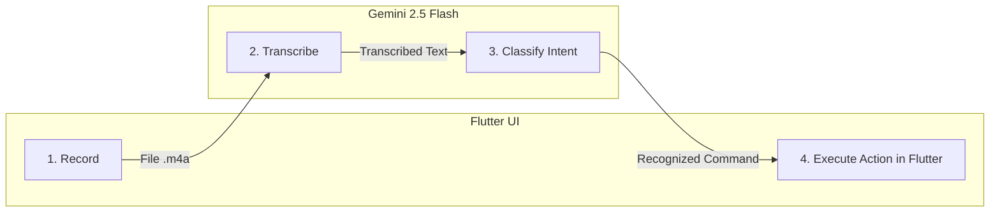

# 🎤 Agent 3: Classic Voice Commands

The **Traditional Voice Assistant** (`VoiceAssistantAgent`) is the ideal architectural pattern when you want the user to trigger discrete, intentional commands via voice, such as:
- *"Change the app color to blue"*
- *"What did I write today?"*
- *"Delete the last entry"*
- *"How can I improve my productivity?"*

---

## 🔄 The 4-Step Pipeline

This agent operates along a deterministic, easy-to-debug pipeline:



1. **Record:** The `record` package captures microphone audio to a local temporary file.
2. **Transcribe:** `DiaryAgent.transcribeAudio()` converts raw audio to text.
3. **Classify:** Gemini categorizes the user's intent into a specific command bucket.
4. **Execute:** Flutter triggers state updates (`AppState`) or SQLite queries (`DiaryRepository`).

---

## 🏷️ Intent Classification

Instead of expecting the AI to generate code or arbitrary outputs in one shot, we first ask it to classify the intent:

```dart
enum VoiceCommandType {
  changeColor,
  answerQuestion,
  summarize,
  deleteEntry,
  unknown,
}

Future<VoiceCommandType> _classifyCommand(String transcription) async {
  final prompt = '''
Classify the following voice command into one of these categories:

1. CHANGE_COLOR: User wants to change app color/theme
2. ANSWER_QUESTION: User asks a general question
3. SUMMARIZE: User requests a summary of entries
4. DELETE_ENTRY: User wants to delete an entry
5. UNKNOWN: Does not match any category

Command: "$transcription"

Reply ONLY with one of these words: CHANGE_COLOR, ANSWER_QUESTION, SUMMARIZE, DELETE_ENTRY, UNKNOWN
''';

  final response = await _gemini.generateContent([Content.text(prompt)]);
  final result = response.text?.trim().toUpperCase() ?? 'UNKNOWN';

  if (result.contains('CHANGE_COLOR')) return VoiceCommandType.changeColor;
  if (result.contains('ANSWER_QUESTION')) return VoiceCommandType.answerQuestion;
  if (result.contains('SUMMARIZE')) return VoiceCommandType.summarize;
  if (result.contains('DELETE_ENTRY')) return VoiceCommandType.deleteEntry;
  return VoiceCommandType.unknown;
}
```

---

## 🦾 Executing Actions: Mutating Flutter State

Once classified, we run the corresponding business logic.

### Example: Theme Color Change
The user might say: *"Turn the app purple"* or *"I want teal"*. Gemini identifies the color, and we map it to Flutter's palette:

```dart
Future<VoiceCommandResult> _handleColorChange(String transcription) async {
  final prompt = '''
The user wants to change the application color.
Command: "$transcription"

Pick ONE color from this list: blue, red, green, purple, orange, pink, teal, indigo, brown, amber.
Reply ONLY with the color name in English.
''';

  final response = await _gemini.generateContent([Content.text(prompt)]);
  final colorName = response.text?.trim().toLowerCase() ?? 'blue';

  final color = _getColorFromName(colorName);

  return VoiceCommandResult(
    type: VoiceCommandType.changeColor,
    message: 'Color changed to $colorName',
    success: true,
    data: {'color': color, 'colorName': colorName},
  );
}
```

In the UI, the voice button captures this result and notifies `AppState`:

```dart
// example/lib/ui/widgets/voice_assistant_button.dart
if (result.type == VoiceCommandType.changeColor) {
  final color = result.data?['color'] as Color?;
  if (color != null && mounted) {
    Provider.of<AppState>(context, listen: false).setAppColor(color);
  }
}
```

The entire user interface updates instantly and reactively!

---

## ⚖️ When Should You Use This Pattern?

- **Advantages:**
  - Highly token-efficient.
  - Robust on intermittent or slow cellular connections.
  - Predictable, deterministic state transitions.
- **Trade-off:**
  - Discrete turn-by-turn interactions rather than a fluid, uninterrupted voice conversation.

In the next chapter, we make the leap to **real-time bidirectional streaming with Gemini Live API**.
