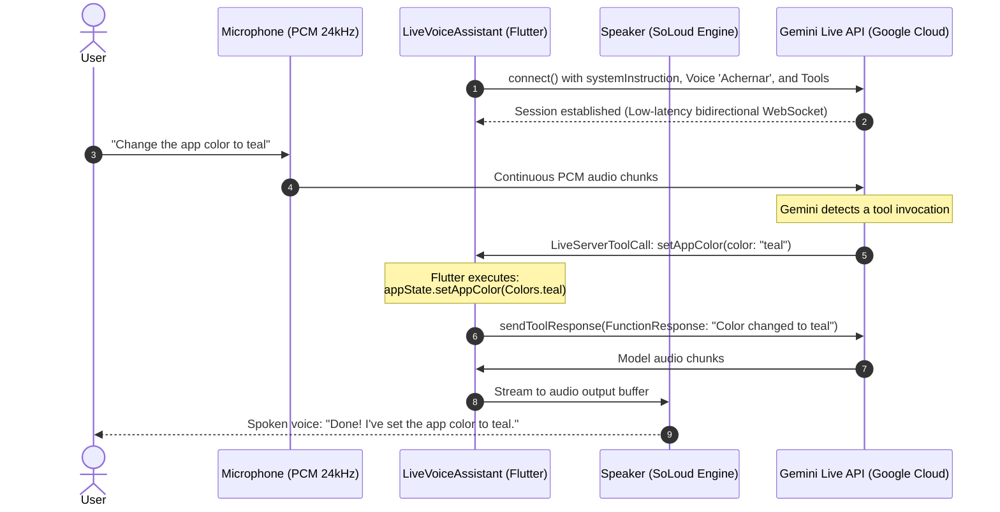

# 🔮 Agent 4: Real-Time with Gemini Live

We now arrive at the most innovative feature of the project: **Gemini Live API**.

Unlike the traditional "record, wait, and listen" paradigm, Gemini Live establishes a **continuous, real-time voice conversation**: you speak naturally, and the model replies with an expressive, human-like voice while executing live tools directly within your Flutter app.

---

## ⚡ How the Live Architecture Works



---

## 🛠️ 1. Configuring the Live Model

In `live_voice_assistant.dart`, we configure `LiveGenerativeModel`:

```dart
_liveModel = FirebaseAI.vertexAI().liveGenerativeModel(
  model: IAModels.liveModelGemini, // 'gemini-live-2.5-flash-native-audio'
  systemInstruction: Content.text('''
You are an intelligent personal assistant for a diary application.
Speak naturally, conversationally, and warmly.

CAPABILITIES:
1. Change the application color/theme
2. Answer questions on any topic
3. Create summaries of diary entries
4. Delete entries (with user confirmation)

CRITICAL RULE:
After executing ANY tool (function call), you MUST ALWAYS
reply immediately to the user via voice confirming the outcome.
  '''),
  liveGenerationConfig: LiveGenerationConfig(
    speechConfig: SpeechConfig(
      voiceName: 'Achernar', // Expressive voice
    ),
    responseModalities: [ResponseModalities.audio],
  ),
  tools: [
    Tool.functionDeclarations([
      _buildChangeColorTool(),
      _buildGetSummaryTool(),
      _buildDeleteEntryTool(),
    ]),
  ],
);
```

:::warning Model Name Matters
For Live API, standard `gemini-2.5-flash` will not produce audio responses. You must specify a native audio model such as `gemini-live-2.5-flash-native-audio`.
:::

---

## 🎙️ 2. Audio Capture & Playback Pipeline

To achieve instant latency, two synchronized engines are utilized:

### A. Input (PCM 24kHz Microphone Capture)
We configure `record` with a 24,000 Hz sample rate, mono channel, 16-bit linear PCM:

```dart
final recordConfig = RecordConfig(
  encoder: AudioEncoder.pcm16bits,
  sampleRate: 24000,
  numChannels: 1,
  echoCancel: true,
  noiseSuppress: true,
  autoGain: true,
);

final audioStream = await _recorder.startStream(recordConfig);
```

### B. Output (SoLoud C++ Audio Engine)
Initialize `flutter_soloud` for low-latency buffer streaming:

```dart
await SoLoud.instance.init(sampleRate: 24000, channels: Channels.mono);
final source = SoLoud.instance.setBufferStream(
  bufferingType: BufferingType.released,
  bufferingTimeNeeds: 0.1,
);
_audioSource = source;
_soundHandle = await SoLoud.instance.play(source);
```

As audio chunks arrive from Gemini, feed them directly to the buffer:

```dart
void _playAudioPart(InlineDataPart part) {
  if (part.mimeType.contains('audio')) {
    SoLoud.instance.addAudioDataStream(_audioSource!, part.bytes);
  }
}
```

---

## 🦾 3. Declaring Tools

Each tool is declared formally with `FunctionDeclaration`:

```dart
FunctionDeclaration _buildChangeColorTool() {
  return FunctionDeclaration(
    'setAppColor',
    'Changes the primary application theme color',
    parameters: {
      'color': Schema.string(
        description: 'Color name in English: blue, red, green, purple, teal...',
      ),
    },
  );
}

FunctionDeclaration _buildGetSummaryTool() {
  return FunctionDeclaration(
    'getDiarySummary',
    'Retrieves a summary of diary entries',
    parameters: {
      'timeRange': Schema.string(
        description: 'Time filter: today, week, month, all',
      ),
    },
  );
}
```

---

## 🔄 4. The Message & Tool Call Loop

Subscribe to the open session:

```dart
Future<void> _processMessagesContinuously() async {
  await for (final response in _session.receive()) {
    final message = response.message;

    // 1. Play incoming audio
    if (message is LiveServerContent) {
      final parts = message.modelTurn?.parts;
      if (parts != null) {
        for (final part in parts) {
          if (part is InlineDataPart) {
            _playAudioPart(part);
          }
        }
      }

      // 2. Handle user interruption (Barge-in)
      if (message.interrupted == true) {
        await _clearAudioBuffer();
      }
    }

    // 3. Handle live tool call
    if (message is LiveServerToolCall && message.functionCalls != null) {
      for (final call in message.functionCalls!) {
        if (call.name == 'setAppColor') {
          final colorName = call.args['color']?.toString() ?? 'blue';
          final color = _getColorFromName(colorName);
          
          // Modify Flutter AppState
          Provider.of<AppState>(context, listen: false).setAppColor(color);

          // Return result back to the live session
          await _session.sendToolResponse([
            FunctionResponse(call.name, {
              'response': 'The color changed to $colorName. Confirm to the user via voice.',
            }),
          ]);
        }
      }
    }
  }
}
```

---

## ✋ 5. Handling Interruptions ("Barge-in")

If the AI is speaking and the user begins speaking again ("Wait, make it blue instead"), the server emits `message.interrupted == true`.

In Flutter, stop the `SoLoud` buffer and create a clean stream to prevent old audio from overlapping with new output:

```dart
Future<void> _clearAudioBuffer() async {
  if (_audioSource != null && _soundHandle != null) {
    SoLoud.instance.setDataIsEnded(_audioSource!);
    await SoLoud.instance.stop(_soundHandle!);
    await _setupAudioOutput(); // Fresh, empty buffer
  }
}
```

You now have a true conversational agent! Next, we'll see how to add custom tools.
