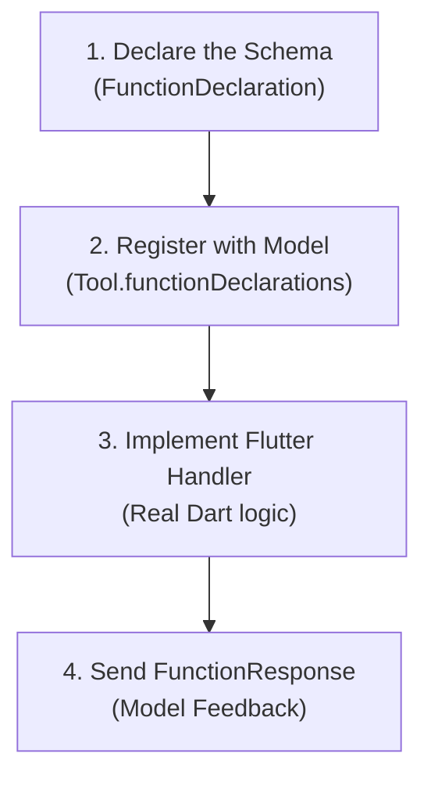

# 🛠️ Creating Custom Tools

The true power of an agentic application lies in its extensibility. You can teach your agent to interact with **any Flutter API**, device sensor, REST endpoint, or database.

In this chapter, you will master the **universal 4-step formula** for adding new tools.

---

## 🧪 The Universal 4-Step Formula



---

## 🎯 Practical Example: `searchDiaryEntries`

Suppose we want the user to be able to say:  
> *"Search my notes for mentions of my trip to Japan"*

### Step 1: Declare the Schema
Define the name, description, and required parameters:

```dart
FunctionDeclaration _buildSearchDiaryTool() {
  return FunctionDeclaration(
    'searchDiaryEntries',
    'Searches diary entries matching a keyword or topic',
    parameters: {
      'query': Schema.string(
        description: 'The keyword or concept to search for in notes',
      ),
      'limit': Schema.integer(
        description: 'Maximum number of entries to return (default 5)',
        nullable: true,
      ),
    },
  );
}
```

:::tip Tool Descriptions are Prompts
The model uses the description to decide **when** to invoke the tool. Write clear, unambiguous summaries of what each tool does.
:::

---

### Step 2: Register with the Model
Add your new tool declaration to the model's tool list:

```dart
final model = FirebaseAI.vertexAI().generativeModel(
  model: IAModels.chatModelGemini,
  tools: [
    Tool.functionDeclarations([
      _buildChangeColorTool(),
      _buildGetSummaryTool(),
      _buildSearchDiaryTool(), // 👈 Registered custom tool
    ]),
  ],
);
```

---

### Step 3: Implement the Flutter Handler
Write the Dart function to query SQLite or local storage:

```dart
Future<void> _handleSearchEntries(FunctionCall call) async {
  // 1. Extract arguments provided by Gemini
  final query = call.args['query']?.toString() ?? '';
  final limit = int.tryParse(call.args['limit']?.toString() ?? '5') ?? 5;

  // 2. Query SQLite
  final results = await _repository.searchEntries(query: query, limit: limit);

  // 3. Prepare response payload
  Map<String, dynamic> responseData;

  if (results.isEmpty) {
    responseData = {
      'found': false,
      'message': 'No entries found matching "$query".',
    };
  } else {
    final listPreview = results
        .map((e) => '- ${e.formattedDate}: ${e.title} (${e.contentPreview})')
        .join('\n');

    responseData = {
      'found': true,
      'count': results.length,
      'entries': listPreview,
      'instruction': 'Summarize these findings naturally for the user.',
    };
  }

  // Step 4: Return payload to the model
  await _session.sendToolResponse([
    FunctionResponse(call.name, responseData),
  ]);
}
```

---

### Step 4: Route in the Tool Call Switch

In the agent's message loop:

```dart
switch (call.name) {
  case 'setAppColor':
    await _handleColorChange(call);
    break;
  case 'searchDiaryEntries':
    await _handleSearchEntries(call); // 👈 Routed handler
    break;
  default:
    debugPrint('Unrecognized tool: ${call.name}');
}
```

---

## 🛡️ Best Practices for Robust Tools

1. **Confirmation for Destructive Actions**:
   - For irreversible operations (`deleteEntry`, `wipeData`), explicitly instruct the model in its system prompt to seek explicit confirmation before invoking the tool.
2. **Defensive Error Handling**:
   - Wrap tool execution in `try / catch`. If a database query fails, return a graceful error payload (`'error': 'Database unavailable'`). The model can then explain the situation courteously rather than hanging silently.
3. **Keep Payloads Concise**:
   - Avoid dumping massive JSON trees into `FunctionResponse`. Provide only the relevant fields the AI needs to compose a helpful response.

Next, we review production guidelines, cost management, and FAQs.
