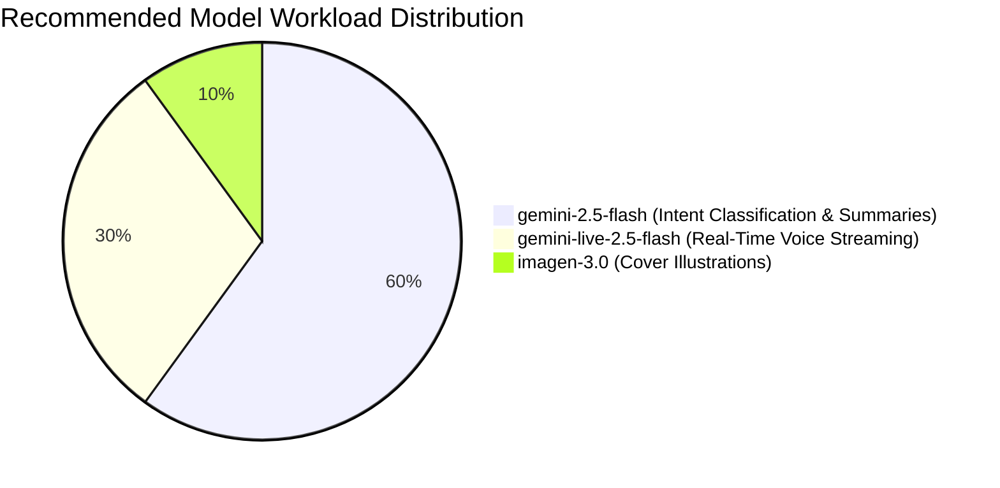

# 💡 Best Practices & FAQ

Shipping an agentic application to production requires attention to three key pillars: **Security**, **Cost & Latency Optimization**, and **User Experience (UX)**.

---

## 🔒 1. Security: Protecting your Application

### Never Expose Raw API Keys in Client Binaries
In naive AI implementations, developers often make the mistake of hardcoding `GEMINI_API_KEY="AIzaSy..."` directly into client apps. Anyone with basic reverse-engineering tools can extract this key and drain your billing account.

### The Firebase Vertex AI Security Advantage
With `firebase_ai`, authentication is managed securely through Firebase:
- No Gemini API secret keys are embedded in your mobile binaries.
- You can enable **Firebase App Check** to ensure that only legitimate requests from genuine devices running your app can call Vertex AI.

---

## 💰 2. Cost and Latency Optimization

1. **Default to `gemini-2.5-flash`**: It is extremely cost-effective and provides more than enough intelligence for 95% of analysis and classification workflows.
2. **Truncate long prompts**: When creating a summary, extract relevant snippets rather than feeding hundreds of pages unnecessarily.
3. **Optimize image sizes**: Downscale photos before attaching them as `InlineDataPart`.
4. **Push-to-Talk for Live Sessions**: In `live_voice_assistant.dart`, audio streaming is active only while the user holds down the mic button, preventing wasted bandwidth on room background noise.

---

## 🎨 3. User Experience (UX)

Agentic apps must clearly communicate what they are doing at every stage:

- **Immediate Visual Cues**: Use pulsing glow animations to signal recording and processing states.
- **Avoid Awkward Silence**: In the agent's system prompt, always mandate an immediate verbal confirmation right after executing a tool.
- **Offline Resilience**: If connectivity drops, allow users to continue creating and editing journal entries locally in SQLite.

---

## ❓ Frequently Asked Questions (FAQ)

### Does this architecture work on iOS, Android, and Desktop?
**Yes.** Flutter compiles natively across platforms. Both `record` and `flutter_soloud` support mobile and desktop operating systems. For Web, ensure proper browser microphone permissions.

### Can I change the voice or language accent in real-time?
Yes! In `LiveGenerationConfig(speechConfig: SpeechConfig(voiceName: '...'))`, select from Google's catalog of expressive voices. `Achernar` is optimized for warm, natural Spanish audio.

### Can multiple agents collaborate together?
Absolutely. A supervisor agent can analyze an intent and delegate tasks to specialized agents (e.g., dispatching search queries to a retrieval agent or image prompts to a visual agent).

---

## 🏁 Congratulations!
You now possess the foundational knowledge and architectural patterns to build world-class agentic Flutter applications. Explore the codebase in the `example/` folder and start empowering your apps with true agency! 🚀
