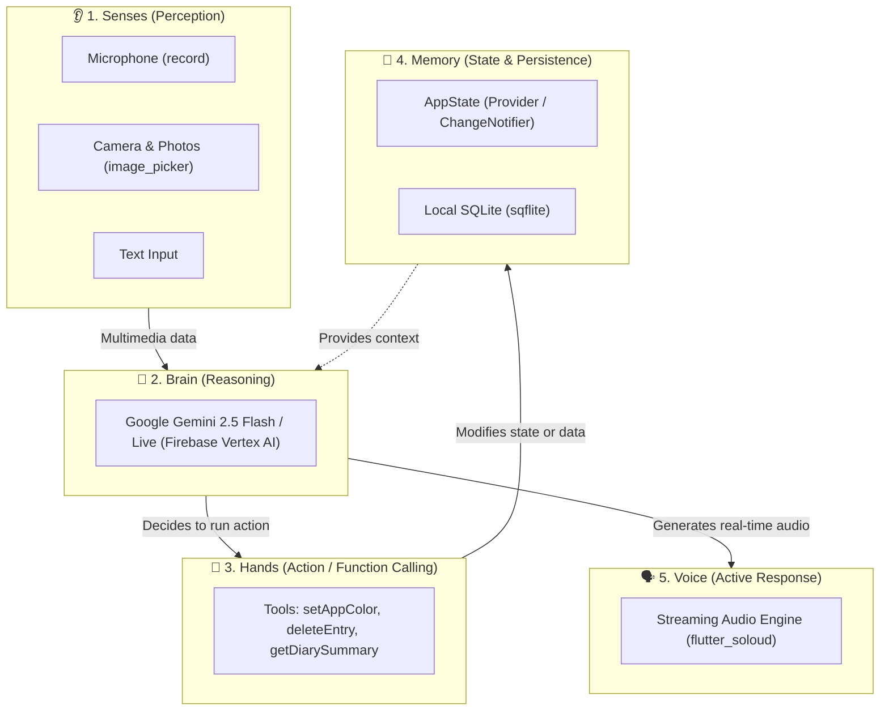

# 🌟 Introduction to Agentic Flutter

Welcome! If you have ever wondered how to build mobile and desktop applications that don't just display static data, but can **think, reason, make decisions, and take real actions** on behalf of the user, you are in the right place.

This guide is crafted so that any developer (even if you are completely new to Artificial Intelligence) can understand and implement **agentic applications with Flutter**, using the real-world **VoiceFlow Diary** project in this repository as a practical, golden reference.

---

## 🤖 What is an "Agentic Application"?

To understand it in the simplest way possible, let's compare a traditional app, an AI chatbot, and an **Agentic App**:

| App Type | How does it work? | Analogy |
| :--- | :--- | :--- |
| **Traditional App** | The user taps buttons, and the app executes predetermined, hardcoded routines. | A TV remote control. |
| **Traditional Chatbot** | The user types a question, and the AI replies with plain text. | An interactive encyclopedia. |
| **Agentic App (AI Agent)** | The AI **understands** user intent, **decides** a plan, and **executes real actions** inside Flutter (changes themes, saves data, deletes records, generates images). | **An intelligent co-pilot with hands and senses.** |

:::tip The Golden Rule of an Agent
A standard language model merely **speaks**.  
An **AI Agent** has **agency**: it can **perceive** its environment, **reason** about what to do, and **act** by invoking real Dart functions inside your Flutter app.
:::

---

## 🧩 The Anatomy of an AI Agent in Flutter

Think of an AI Agent in Flutter as an entity made up of 5 fundamental organs:

1. **🧠 The Brain**: **Google Gemini 2.5 Flash and Gemini Live**, powered by the official `firebase_ai` SDK. It understands intent and makes autonomous decisions.
2. **👂 The Senses**: Capturing real-world input: streaming microphone audio (`record`), camera shots, or photo gallery items (`image_picker`).
3. **🦾 The Hands (Function Calling / Tools)**: Tools that you provide to the AI. The AI can call real Dart functions to change UI, trigger database queries, or perform device actions.
4. **💾 The Memory**: Reactive Flutter state (`AppState`) and local SQLite persistence (`sqflite`), keeping notes and preferences intact.
5. **🗣️ The Voice**: Ultra-low-latency native speech synthesis streaming continuous audio to the speaker via `flutter_soloud`.

---

## 📱 What does VoiceFlow Diary do?

The sample app is **VoiceFlow Diary**, an intelligent personal journal showcasing 3 distinct agent interaction modes:

1. **Multimodal Analysis Agent (`DiaryAgent`)**: Analyzes notes and photos to automatically detect emotions, extract smart tags, summarize content, and generate artistic cover illustrations with Imagen 3.
2. **Traditional Voice Assistant (`VoiceAssistantAgent`)**: Records your voice, transcribes it, classifies intent, and executes discrete commands (e.g., changing the app theme).
3. **Real-Time Live Assistant (`LiveVoiceAssistant`)**: Fluid, continuous bidirectional voice conversation with **Gemini Live API**. Speak naturally in Spanish or English, and receive instant spoken replies while actions happen live on your screen.

---

## 🗺️ Roadmap of this Guide

We have structured this guide into bite-sized, hands-on chapters:

- **[Core Concepts](01-core-concepts.md)**: How Function Calling and streaming work in Flutter.
- **[Quick Start & Setup](02-quick-start.md)**: Setting up Firebase Vertex AI and dependencies.
- **[System Architecture](03-architecture.md)**: Clean separation of UI, State, and AI Agents.
- **[Agent 1: Multimodal Analysis](04-diary-agent.md)**: Sentiment, tags, and automated summaries.
- **[Agent 2: Visual Generation](05-image-generation.md)**: Custom illustrations using Imagen 3.
- **[Agent 3: Classic Voice Commands](06-voice-assistant.md)**: The Record ➔ Transcribe ➔ Classify ➔ Execute pipeline.
- **[Agent 4: Real-Time Live Agent](07-live-agent.md)**: Sub-second voice conversations with live Function Calling.
- **[Create Custom Tools](08-custom-tools.md)**: Giving your agent brand new superpowers.
- **[FAQ & Best Practices](09-faq-best-practices.md)**: Production tips on security, costs, and UX.

Let's dive in and start building agentic applications! 🚀
